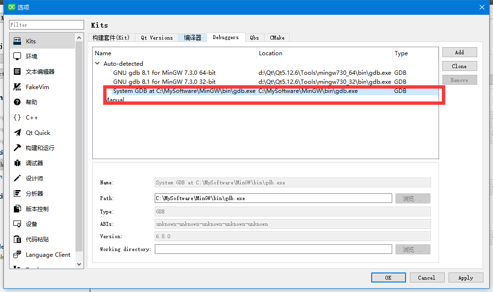
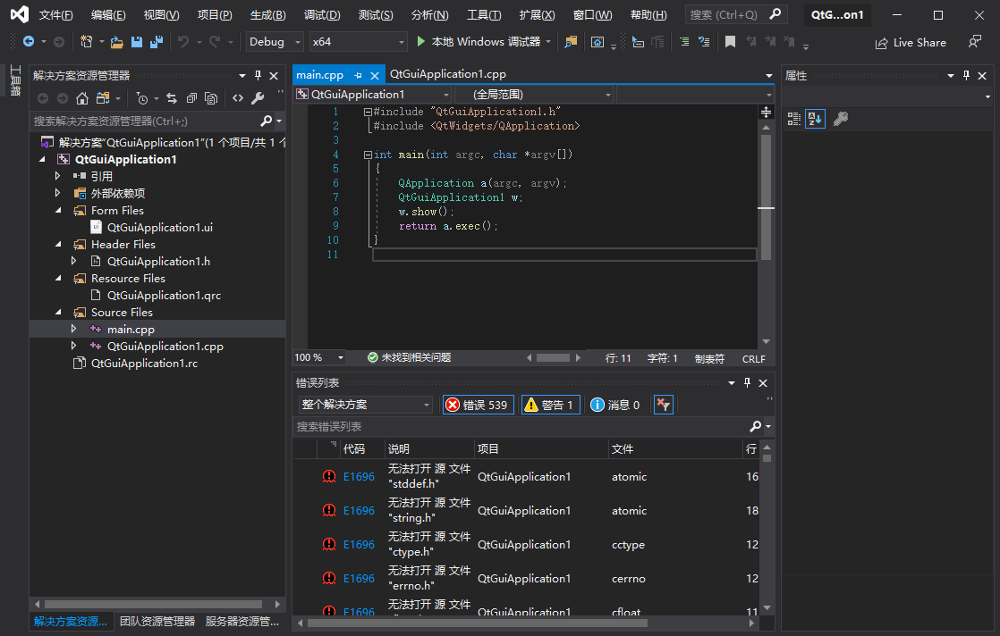
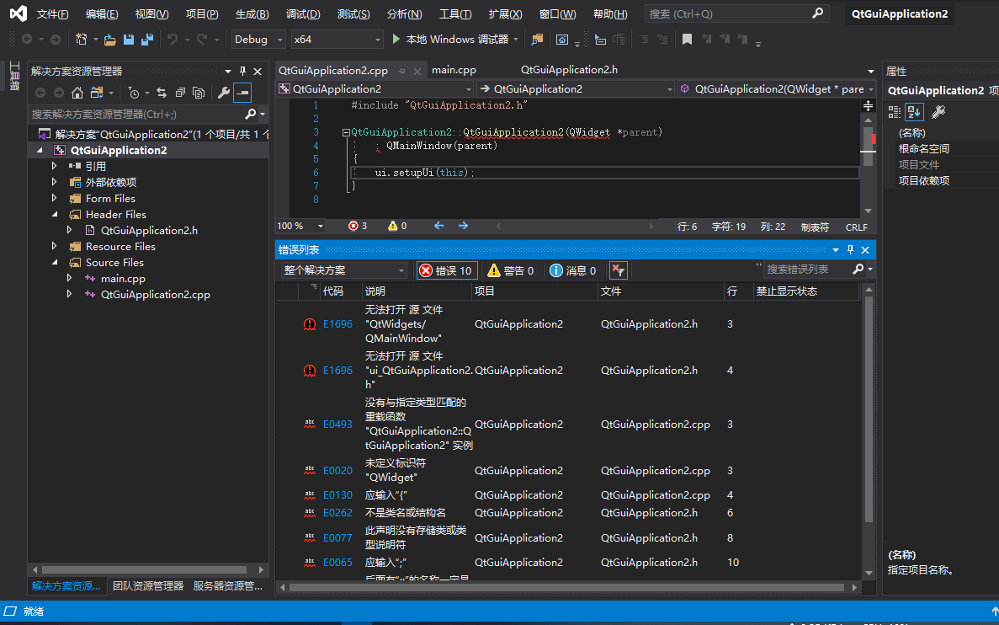
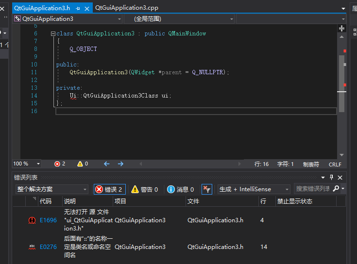

下载地址

官方下载地址：
http://download.qt.io/archive/qt/

安装教程
Qt 5.12长期支持版本正式发布(带下载链接)
https://blog.csdn.net/nicai_xiaoqinxi/article/details/84995134

Win下Qt5.12的下载、安装、配置及使用
https://blog.csdn.net/Vantablack/article/details/92799607

学习教程
Qt教程，Qt5编程入门教程（非常详细）
http://c.biancheng.net/qt/

《Qt 学习之路 2》目录
https://www.devbean.net/2012/08/qt-study-road-2-catelog/
2012年开始写的，讲的原理比较多


[《Qt编程指南》](https://qtguide.ustclug.org/)
讲的原理比较多

[CSDN一个博主写的Qt编程](https://blog.csdn.net/rl529014/category_6055791.html)


中国大学MOOC - 嵌入式基础，有Qt部分


[Qt手动布局和添加控件](https://www.cnblogs.com/wxiaojun/p/6611843.html)
```
申明控件使用 Q类名 *控件名 = new Q类名；格式对控件进行赋值使用  控件名->setText("文本");布局分为垂直布局和水平布局，分别为QVBoxLayout和QHBoxLayout，使用时需要申明，Q布局类名 *布局名 = new Q布局类名；向布局剧中添加控件使用布局名cmdLayout->addWidget(控件名);最后申明窗口类，进行显示。
```
---


安装：
**选择安装项的时候**
>需要用vs调用qt的话要装 MSVS 2017 啥的。
>需要装 MinGw X.X.X 64-bit  不然会缺文件。无法构建工程。
>Sources也选了吧


环境变量也添加
Qt\5.12.x\mingwxx_64bit\bin
Qt\tool]mingwxxx_xx\bin


开始配置VS环境下的Qt
https://blog.csdn.net/Vantablack/article/details/92799607

第一行 扩展->管理扩展，然后左边选择联机，然后Ctrl+E搜索，输入qt，回车
（使用手机流量下载会好的。）

然后选择Qt Visual Studio Tools，Download，然后等待下载完成（好像很有点慢）

然后安装这个。

打开VS，扩展里面会多一个Qt VS Tools，打开里面的Qt Options
打开之后添加一个
Qt\Qtx.x.x\msvc2017


---
# bug

Qt creator 中的Kits设置，改不了默认的minGW路径。


构建工程错误(可能是mingw配置错误了)


如果qt安装的时候没装qt mingw，会有以下错误：

500多个报错。


qt装了qt mingw之后，报错10个，不知道为啥，如图。




一般来说，以上的错误可以通过重新 新建工程来解决。


- QT在VS环境下双击 * .ui打不开Qt designer(Qt设计师)的解决方法


在解决方案资源管理器中，右击你的 xxx.ui文件，会有打开方式，此时列表中默认值是 Qt designer，

但我也不知道为什么此时就打不开，选中它，点击“移除”按钮

然后再在指定目录把它添加进来设置为默认值，即 点“添加”，在弹出的窗口中“浏览”，选择你QT版本的安装目录

在我这里是“D:\Qt5.6.2\5.6\msvc2013\bin” ，bin文件夹下有个designer.exe 选中它即可（反正就是把designer.exe自己手动添加进来）

添加完成中设置为默认值，然后确定
————————————————
版权声明：本文为CSDN博主「TTeN」的原创文章，遵循 CC 4.0 BY-SA 版权协议，转载请附上原文出处链接及本声明。
原文链接：https://blog.csdn.net/TTendy/article/details/76599409


或者切换64bit  32bit版本试试


- 用qt creator 建立工程，编译的时候启动程序失败，路径或者权限错误?
20191230

22:47:54: Starting F:\test\QtProjects\mooc\temperature\build-temperature-Desktop_Qt_5_12_6_MinGW_64_bit-Debug\debug\temperature.exe ...
22:47:54: 启动程序失败，路径或者权限错误?
22:47:54: F:/test/QtProjects/mooc/temperature/build-temperature-Desktop_Qt_5_12_6_MinGW_64_bit-Debug/debug/temperature.exe exited with code -1
22:47:54: The process failed to start. Either the invoked program "F:/test/QtProjects/mooc/temperature/build-temperature-Desktop_Qt_5_12_6_MinGW_64_bit-Debug/debug/temperature.exe" is missing, or you may have insufficient permissions to invoke the program.

未解决。。。


- dial表盘+lcdNumber数码管显示范围调整
修改dial 的 范围即可


---

# Tip
Qt 官方在编译 Qt5 库的时候都是开启 C++11 特性的，如果我们要在自己项目代码启用新标准，需要在 .pro 文件里面添加一行：
CONFIG += c++11


- 中文显示乱码
在头文件中增加几句：
```c
#ifdef WIN32  
#pragma execution_character_set("utf-8")  
#endif
```

信号与槽 connect建议这样写：
connect(Object, SIGNAL(valueChanged(int)), Object, SLOT(setValue(int)));


- [QT打包程序,一键打包](https://blog.csdn.net/qq_31073871/article/details/79913892)
首先选择release模式，生成exe程序，然后新建一个空文件夹pkt，把生成的exe、用到的数据库文件、配置ini文件等拷进pkt文件夹

方法一：

打开->开始->QT->QT for desktop，这样会打开一个命令提示符窗口，输入：

windeployqt  E:\pkt\meter.exe

回车即可。（exe文件的路径不用输入，直接把exe文件拖放进命令提示符窗口即可）
————————————————
版权声明：本文为CSDN博主「qq_610642」的原创文章，遵循CC 4.0 BY-SA版权协议，转载请附上原文出处链接及本声明。
原文链接：https://blog.csdn.net/qq_31073871/article/details/79913892


---
[Qt5 emit——不同窗口之间的触发信号](https://www.jianshu.com/p/30636b8ca0e1)


窗口1和窗口2，点击窗口1中某按钮，窗口2中进行某函数动作。对于这种情况，我们常采用emit关键字来实现。
在窗口1的函数体中，先进性信号和槽函数声明：
```c
class win1_class:public QWidget
{
  // 信号声明区
  signal:
        // 声明信号 mySignal()
        void mySignal();
        // 声明信号 mySignal(int)
        void mySignal(int x);
        // 声明信号 mySignalParam(int,int)
        void mySignalParam(int x,int y);
  slots:
         // 声明槽函数 mySlot()
        void mySlot1();
};

void win1_class::mySlot1()
{
  emit mySignal();
  //emit mySignal(1);
  //emit mySignal(1,2);
}
```

在窗口2的函数体中，进行信号和槽函数关联：
```c
class win2_class:public QWidget
{
  win1_class *app1= new win1_class;
slots:
  void mySlot2();

// 信号与槽关联
connect(app1, SIGNAL(mySignal()), this, SLOT(mySlot2()));
}；

void win2_class::mySlot2()
{
    // 函数实现
}
```